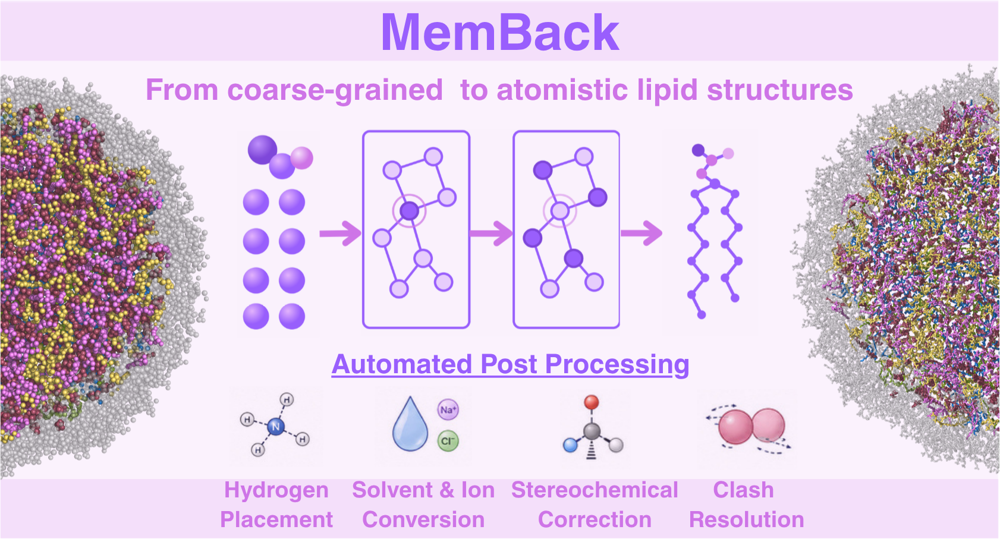

<p align="center">  </p>

# MemBack
[//]: # (Badges)

| **Latest release** | [](https://github.com/BioMemPhys-FAU/memback/releases)  |
| :------ |:---------------------------------------------------------------------------------------------------------------------------------------------------------------------------------------------------------------------------------------------------------------------------------------------------------------------------------------------------------------------------------------------------------------------------------------------------------------------------------------------------------------------------------------------------------------------------------------------------------------------------------------------------------------------------------------------------------------------------------------------------------------------------------------------------------------------------------------------------------------------------------------------------------------------------------------------------------------------------------------------------------------------------------------------------------------------------------------------------------------------------------------------------------------------------------------------------------------------------------------------------------------------------------------------------------------------------------------------------------------------------------------------------------------------------------------------------------------------------------------------------------------------------------------------------------------------------------------------------------------------------------------------------------------------------------------------------------------------------------------------------------------------------------------------|
| **Status** | [](https://github.com/BioMemPhys-FAU/memback/actions?query=branch%3Amain+workflow%3Atests) [](https://codecov.io/gh/BioMemPhys-FAU/memback/branch/main)                                                                                                                                                                                                                                                                                                                                                                                                                                                                                                                                                                                                                                                                                                                                                                                                                                                                                                                                                                                                                                                                                                                                                                                                                                                                                                                                                                                                                                             |
| **Community** | [](https://www.gnu.org/licenses/gpl-3.0)  [![Powered by MDAnalysis](https://img.shields.io/badge/powered%20by-MDAnalysis-orange.svg?logoWidth=16&logo=data:image/x-icon;base64,AAABAAEAEBAAAAEAIAAoBAAAFgAAACgAAAAQAAAAIAAAAAEAIAAAAAAAAAAAAAAAAAAAAAAAAAAAAAAAAAAAAAAAAJD+XwCY/fEAkf3uAJf97wGT/a+HfHaoiIWE7n9/f+6Hh4fvgICAjwAAAAAAAAAAAAAAAAAAAAAAAAAAAAAAAACT/yYAlP//AJ///wCg//8JjvOchXly1oaGhv+Ghob/j4+P/39/f3IAAAAAAAAAAAAAAAAAAAAAAAAAAAAAAAAAAAAAAJH8aQCY/8wAkv2kfY+elJ6al/yVlZX7iIiI8H9/f7h/f38UAAAAAAAAAAAAAAAAAAAAAAAAAAB/f38egYF/noqAebF8gYaagnx3oFpUUtZpaWr/WFhY8zo6OmT///8BAAAAAAAAAAAAAAAAAAAAAAAAAAAAAAAAgICAn46Ojv+Hh4b/jouJ/4iGhfcAAADnAAAA/wAAAP8AAADIAAAAAwCj/zIAnf2VAJD/PAAAAAAAAAAAAAAAAICAgNGHh4f/gICA/4SEhP+Xl5f/AwMD/wAAAP8AAAD/AAAA/wAAAB8Aov9/ALr//wCS/Z0AAAAAAAAAAAAAAACBgYGOjo6O/4mJif+Pj4//iYmJ/wAAAOAAAAD+AAAA/wAAAP8AAABhAP7+FgCi/38Axf4fAAAAAAAAAAAAAAAAiIiID4GBgYKCgoKogoB+fYSEgZhgYGDZXl5e/m9vb/9ISEjpEBAQxw8AAFQAAAAAAAAANQAAADcAAAAAAAAAAAAAAAAAAAAAAAAAAAAAAAAAAAAAjo6Mb5iYmP+cnJz/jY2N95CQkO4pKSn/AAAA7gAAAP0AAAD7AAAAhgAAAAEAAAAAAAAAAACL/gsAkv2uAJX/QQAAAAB9fX3egoKC/4CAgP+NjY3/c3Nz+wAAAP8AAAD/AAAA/wAAAPUAAAAcAAAAAAAAAAAAnP4NAJL9rgCR/0YAAAAAfX19w4ODg/98fHz/i4uL/4qKivwAAAD/AAAA/wAAAP8AAAD1AAAAGwAAAAAAAAAAAAAAAAAAAAAAAAAAAAAAALGxsVyqqqr/mpqa/6mpqf9KSUn/AAAA5QAAAPkAAAD5AAAAhQAAAAEAAAAAAAAAAAAAAAAAAAAAAAAAAAAAADkUFBSuZ2dn/3V1df8uLi7bAAAATgBGfyQAAAA2AAAAMwAAAAAAAAAAAAAAAAAAAAAAAAAAAAAAAAAAAB0AAADoAAAA/wAAAP8AAAD/AAAAWgC3/2AAnv3eAJ/+dgAAAAAAAAAAAAAAAAAAAAAAAAAAAAAAAAAAAAAAAAA9AAAA/wAAAP8AAAD/AAAA/wAKDzEAnP3WAKn//wCS/OgAf/8MAAAAAAAAAAAAAAAAAAAAAAAAAAAAAAAAAAAAIQAAANwAAADtAAAA7QAAAMAAABUMAJn9gwCe/e0Aj/2LAP//AQAAAAAAAAAA)](https://www.mdanalysis.org) | 

Neural backmapping of coarse-grained **Martini 3** membranes to all-atom
**CHARMM36** structures.

MemBack predicts heavy-atom positions with an SE(3)-equivariant graph network
(PaiNN-style), then rebuilds a simulation-ready system around them: hydrogens,
chirality correction, clash relaxation, water and ion replacement, and a GROMACS
topology with a minimisation script.

> **Alpha release.** Interfaces may change between versions. Output is a raw
> model prediction and must be energy-minimised before production MD.

---

## Requirements

- Python ≥ 3.9
- [PyTorch](https://pytorch.org/get-started/locally/) and
  [PyTorch Geometric](https://pytorch-geometric.readthedocs.io/en/latest/install/installation.html)
- MDAnalysis, NumPy
- GROMACS — only for the minimisation step, not for backmapping itself

A GPU is optional. The shipped checkpoint is small enough to run comfortably on
CPU; CUDA is used automatically when available.

## Installation

Install torch and torch-geometric first, following their own instructions for
your platform and CUDA version. Then:

```bash
git clone https://github.com/BioMemPhys-FAU/memback.git
cd MemBack
python -m venv venv && source venv/bin/activate
pip install .
```

Editable installs (`pip install -e .`) work identically and are the better
choice if you plan to modify the code.

The lipid databases, force field and model checkpoint ship inside the package,
so nothing needs to be configured after installation and the clone can be
deleted afterwards. Note that this makes the install roughly 130 MB, most of it
the checkpoint.

Verify:

```bash
memback --version
memback --help
```

## Quick start

```bash
memback membrane_cg.gro
```

That reads the coarse-grained structure and writes everything into
`membrane_cg_backmapped/`. Then minimise and equilibrate:

```bash
cd membrane_cg_backmapped
bash run_sim.sh
```

### What `run_sim.sh` does

The script runs three stages in sequence inside the output directory:

1. **Minimisation.** Steepest descent with `min.mdp`, using position and
   dihedral restraints on the lipids referenced to `backmapped_ordered.gro`.
   Produces `min.gro`.
2. **Equilibration.** Six consecutive runs, `step6.1_equilibration` through
   `step6.6_equilibration`, each starting from the previous one's output (the
   first from `min.gro`). Restraints are again referenced to
   `backmapped_ordered.gro`; their strengths are set in the individual
   `step6.*_equilibration.mdp` files. These runs use `index.ndx`.
3. **Chirality check.** `check_chirality.py` is run on the final frame,
   `step6.6_equilibration.gro`, to confirm that every lipid stereocentre has the
   correct handedness.

### Checking chirality

Backmapping and early relaxation can occasionally leave a stereocentre (for
example the glycerol C2 of a phospholipid) inverted or squashed flat. An
inverted centre is a different stereoisomer and will not correct itself during
unrestrained MD, so it is worth checking before production. `run_sim.sh` does
this automatically, and you can run the check on any structure yourself:

```bash
./check_chirality.py step6.6_equilibration.gro
```

The reference handedness is taken from the ±120° dihedral restraints in
`toppar/*.itp` (use `--toppar DIR` if your topologies live elsewhere). Example
output:

```
resname  center    total       ok    wrong       flat   collin    fixed
DLIPC    C2          184      183        1          0        0        0
DPPC     C2          184      183        1          0        0        0
----------------------------------------------------------------------
total centers   : 368
correct         : 366 (99.46%)
wrong sign      : 2
flat/degenerate : 0
collinear tips  : 0 (skipped)
Re-run check_chirality.py with --fix option to fix wrong sign and flat defects.
```

Each row is one stereocentre type (residue name and centre atom), and the
columns count how many instances of it fall into each category:

| Column | Meaning |
| --- | --- |
| `total` | Number of instances of this centre in the structure (one per lipid). |
| `ok` | Correct handedness and a well-formed tetrahedron. |
| `wrong` | Well-formed centre with inverted handedness (the wrong stereoisomer). |
| `flat` | Centre almost coplanar with its substituents, so its handedness is undefined. |
| `collin` | Substituent atoms nearly collinear; the centre cannot be judged and is skipped. |
| `fixed` | Centres repaired in this run (only non-zero with `--fix`). |

In the example above, one DLIPC and one DPPC lipid (2 of 368 centres) have the
wrong handedness. If `wrong` and `flat` are both zero, nothing needs to be
done. A non-zero `collin` count is rare and indicates a badly distorted
geometry that should be inspected by hand.

### Fixing wrong chirality

Re-run the check with `--fix`:

```bash
./check_chirality.py step6.6_equilibration.gro --fix
```

```
resname  center    total       ok    wrong       flat   collin    fixed
DLIPC    C2          184      183        1          0        0        1
DPPC     C2          184      183        1          0        0        1
----------------------------------------------------------------------
total centers   : 368
correct         : 366 (99.46%)
wrong sign      : 2
flat/degenerate : 0
collinear tips  : 0 (skipped)
fixed           : 2
failed          : 0
wrote step6.6_equilibration_chirfix.gro (4 atoms modified)
Energy minimisation is recommended before running the next step.
```

The summary counts (`correct`, `wrong sign`, …) describe the input structure;
the `fixed` and `failed` lines report the outcome of the repair. For each
`wrong` or `flat` centre, only the centre atom is moved onto the correct face
of its substituents and its hydrogen is re-placed. The substituents themselves
are not touched, and every repair is re-checked. The result is written to
`<input>_chirfix.gro` (change with `-o FILE`); velocities, header and box are
kept. Any `failed` entries should be inspected manually.

**A restrained energy minimisation is required after fixing.** The repair
moves atoms without regard for the surrounding bond geometry and neighbours,
so the corrected structure must be relaxed before it is simulated further.

## Command-line options

```
memback [-h] [-o DIR] [-e DIR] [-m CKPT] [--device {auto,cpu,cuda}] [-V] input
```

| Option | Meaning |
| --- | --- |
| `input` | CG structure in any single-frame format MDAnalysis reads (`.gro`, `.pdb`, …). Must carry box dimensions — periodic images are used when building the graph. |
| `-o`, `--output DIR` | Output directory. Default `<input stem>_backmapped`. |
| `-e`, `--extension DIR` | Folder of extra `.map` / `.bnd` / `.itp` files for lipids outside the built-in databases. |
| `-m`, `--model CKPT` | Alternative checkpoint. Default is the version in `model/`. |
| `--device` | `auto` (default), `cpu`, or `cuda`. `cuda` errors out if no GPU is visible. |
| `-V`, `--version` | Print version and exit. |

Only single frames are supported. To backmap a trajectory, extract frames first
and run MemBack on each.

## Outputs

Written into the output directory:

| File | Contents |
| --- | --- |
| `backmapped_ordered.gro` | The above plus water and ions, residues grouped by type as GROMACS expects. **This is the structure to simulate.** |
| `topol.top` | Topology including `toppar/forcefield.itp` and one `.itp` per lipid, with a `[ molecules ]` count matching the structure. |
| `min.mdp` | Steepest descent with position and dihedral restraints on lipids. |
| `run_min.sh` | `gmx grompp` + `gmx mdrun` for that minimisation. |
| `toppar/` | CHARMM36 force field plus the per-lipid `.itp` files actually used. |

## Extending to new lipids

Any lipid MemBack doesn't ship can be added through an extension folder without
touching the installed package. Files are matched by suffix:

```
my_lipids/
├── mylipids.map     # AA -> CG mapping, one [RESNAME] section per lipid
├── mylipids.bnd     # CG bead bonds and angles, one [RESNAME] section per lipid
└── XXXX.itp         # GROMACS topology, one file per lipid, named <RESNAME>.itp
```

```bash
memback membrane_cg.gro -e ./my_lipids
```

Extension entries override the built-in databases for the same residue name, so
the same mechanism patches a shipped lipid whose mapping you want to change. The
hydrogen database is derived automatically from the `.itp` files and cached as
`ext_hdb.hdb` inside the extension folder.

The `.map` and `.bnd` formats follow
[PyCGTOOL](https://github.com/jag1g13/pycgtool) conventions:

```
[POPC]
NC3  Q1   N C12 C13 C14 C15    ; bead name, Martini type, then AA atoms
PO4  Q5   P O11 O12 O13 O14
...
```

```
[POPC]
NC3 PO4          ; bonds, two bead names per line
PO4 GL1
                 ; blank line separates bonds from angles
NC3 PO4 GL1      ; angles, three bead names per line
```

Databases live under `src/memback/data/` and the checkpoint under
`src/memback/model/`, both bundled as package data. `MEMBACK_ROOT` overrides
their location if you want to keep them outside the installation; it must point
at a directory containing `data/` and `model/` subdirectories.

Residue naming differences between Martini 3 and CHARMM (`CHOL` → `CHL1`,
`DLPC` → `DLIPC`, and so on) are translated automatically via
`martini3_to_charmm_lipids` in `src/memback/config.py`. Water (`W`) and ions
(`ION`) are excluded from prediction and rebuilt separately.

## Python API

```python
from memback.pipeline import backmapping

backmapping(
    input_path="membrane_cg.gro",
    filename="output_dir",        # optional
    ext_path="./my_lipids",       # optional
    model_path=None,              # optional; defaults to the shipped checkpoint
    device=None,                  # optional; defaults to CUDA when available
)
```

Loading the model on its own:

```python
import torch
from memback.models.equivariant_memback import EquivariantBackmap
from memback.config import model_path

model = EquivariantBackmap.from_checkpoint(model_path, map_location="cpu")
```

`model(batch)` returns `[N_beads, max_atom_number, 3]` — displacements of each
bead's heavy atoms relative to that bead's position. Slots beyond a bead's real
atom count are padding; `data.mask` selects the valid ones.

## How it works

1. **Graph construction** — each lipid becomes a graph. Nodes are CG beads with
   invariant features (Martini class, size, polarity, neighbour count, number of
   mapped heavy atoms); edges come from the `.bnd` bond definitions. Bead
   positions are stored relative to the lipid's centre of geometry, with the
   minimum-image convention applied.
2. **Prediction** — all lipids are batched and passed through the equivariant
   network. Geometry enters only through relative vectors and their norms, so
   predictions rotate and translate with the input; no rotational augmentation is
   needed.
3. **Reconstruction** — predicted displacements are added back to bead positions
   and the lipid centre of geometry, then assembled into an MDAnalysis universe
   with atom names read from the mapping.
4. **Repair** — hydrogens placed with a Python port of the GROMACS `pdb2gmx`
   geometry routines driven by the `.hdb` database; chirality checked against
   improper dihedrals in the `.itp` files and inverted where wrong; residual
   clashes relaxed.
5. **Solvent** — Martini water beads become tetrahedrally-arranged TIP3P
   molecules (4 per bead by default); Martini ion beads become their CHARMM
   equivalents.
6. **Setup** — force field and lipid topologies copied into `toppar/`, topology
   and minimisation input written.

## Model

| | |
| --- | --- |
| Architecture | PaiNN-style equivariant message passing |
| Hidden channels | 512 |
| Layers | 5 |
| Radial basis | 20 Gaussians, 12 Å cosine cutoff |
| Output | 6 heavy-atom displacements per bead |
| Checkpoint | `src/memback/model/memback_0.1.1_state_dict.pt` |

Checkpoints are stored as `{"state_dict": ..., "config": ...}`, so
`from_checkpoint` rebuilds the architecture from the file itself and never
depends on module paths.

## Coverage

55 lipid types across PC, PE, PS, PG, PA, PI, SM, cardiolipin and cholesterol
head groups, with 440 CHARMM lipid topologies available for the topology step.
Anything else needs an extension folder.

## Troubleshooting

**`Residue XXXX not found in mapping. Skipping...`** — that residue has no
`.map` entry and is dropped from the output. Supply it via `-e`.

**`error: MemBack data files are missing`** — the installation is incomplete,
or `MEMBACK_ROOT` is set and points somewhere without `data/` and `model/`.
Unset that variable, or reinstall.

**`Could not find XXXX.itp ... for forcefield`** — prediction succeeded but no
CHARMM topology exists for that lipid, so `topol.top` will not grompp. Add the
`.itp` to the extension folder.

**`ModuleNotFoundError` on an old checkpoint** — checkpoints saved as whole
pickled objects store their class's module path. Re-save as a state dict, which
is what the current format does.

**CUDA out of memory** — all lipids are batched into a single forward pass. Use
`--device cpu` for very large systems.

## License

MemBack is free software, licensed under the GNU General Public License v3.0 or later. See LICENSE for the full text.

This applies to MemBack's own source code. The bundled force field, lipid topologies and mapping files come from other 
projects and keep their own terms — see THIRD_PARTY.md for attribution, citation requests and a redistribution caveat 
regarding the CHARMM-GUI-generated topologies.